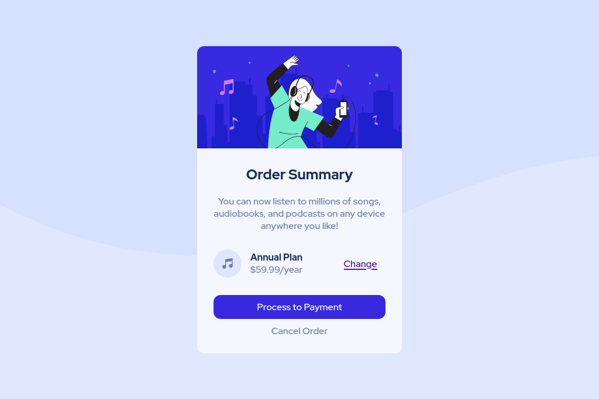

# Frontend Mentor - Order summary card solution

This is a solution to the [Order summary card challenge on Frontend Mentor](https://www.frontendmentor.io/challenges/order-summary-component-QlPmajDUj). Frontend Mentor challenges help you improve your coding skills by building realistic projects. 

## Overview

### Screenshot




### Link

- [Demo](https://azeezqad.github.io/frontend-mentor-challenges/order-summary-component-main/)

### Built with

[](https://skills.thijs.gg)


### What I learned

I learned how to center an element . 


```css
      main {
        position: absolute;
        left: 50%;
        top: 50%;
        transform: translate(-50%, -50%);
        width: 350px;
        border-radius: 12px;
        overflow: hidden;
        text-align: center;
      }
```


### Continued development

I will continue practice and solving new challenges to improve my skills and keep learning new things everyday.


<!-- ### Useful resources

- [CSS background-image Property](https://www.w3schools.com/cssref/pr_background-image.php)  -->

## Author

- Frontend Mentor - [@azeezqad](https://www.frontendmentor.io/profile/azeezqad)
