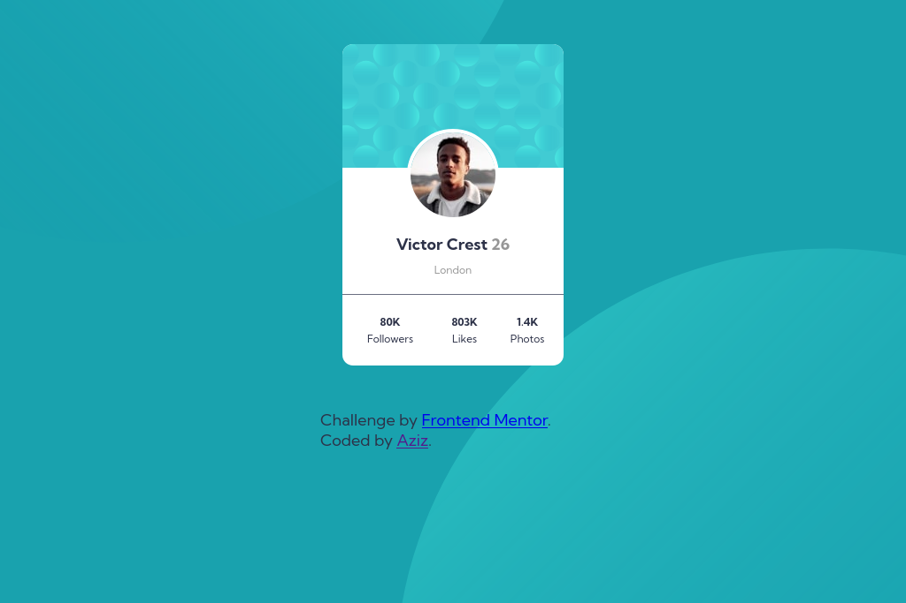

# Frontend Mentor - Profile card component solution

This is a solution to the [Profile card component challenge on Frontend Mentor](https://www.frontendmentor.io/challenges/profile-card-component-cfArpWshJ). Frontend Mentor challenges help you improve your coding skills by building realistic projects. 

## Overview

### Screenshot




### Links

- [Demo]()

### Built with

[](https://skills.thijs.gg)


### What I learned

I learned how to set two image to body tag. 


```css
     body {
        font-family: "Kumbh Sans", sans-serif;
        font-size: 18px;
        color: var(--blue);
        background-color: var(--dark-cyan);
        background-image: url(./images/bg-pattern-top.svg),
          url(./images/bg-pattern-bottom.svg);
        background-repeat: no-repeat, no-repeat;
        background-position: top 150% left -780%, bottom 160% right -870%;
        margin: 0;
        padding: 0;
        height: 100%;
        overflow: hidden;
      }
```


### Continued development

I will continue practice and solving new challenges to improve my skills and keep learning new things everyday.


### Useful resources

- [CSS background-image Property](https://www.w3schools.com/cssref/pr_background-image.php) 

## Author

- Frontend Mentor - [@azeezqad](https://www.frontendmentor.io/profile/azeezqad)
