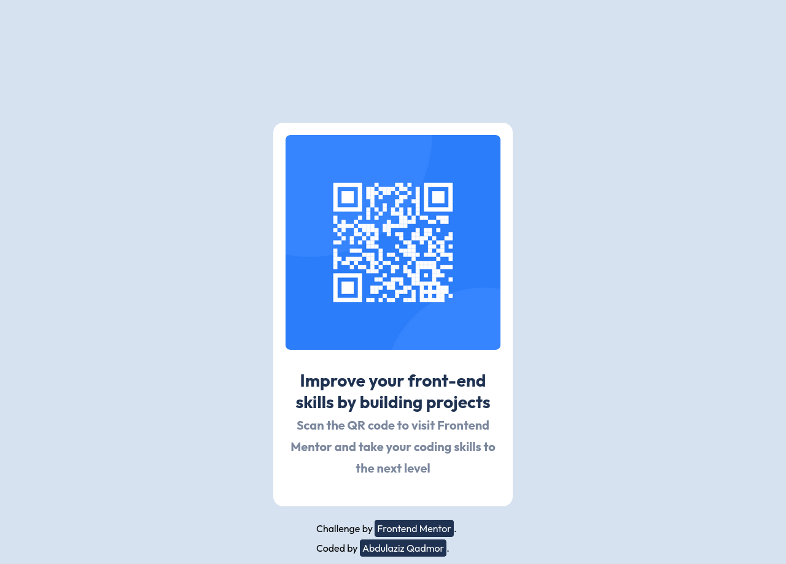

# Frontend Mentor - QR code component solution

This is a solution to the [QR code component challenge on Frontend Mentor](https://www.frontendmentor.io/challenges/qr-code-component-iux_sIO_H). Frontend Mentor challenges help you improve your coding skills by building realistic projects. 


## Overview

### Screenshot




### Links

- [Demo]()

### Built with

[](https://skills.thijs.gg)


### What I learned

I learned how to use the :root selector to set custom properties. I also practiced both html and css. 


```css
    :root{
        --white: hsl(0, 0%, 100%);
        --light-gray: hsl(212, 45%, 89%);
        --grayish-blue: hsl(220, 15%, 55%);
        --dark-blue: hsl(218, 44%, 22%);
      }
```


### Continued development

I will continue practice and solving new challenges to improve my skills and keep learning new things everyday.


### Useful resources

- [MDN CSS custom properties](https://developer.mozilla.org/en-US/docs/Web/CSS/Using_CSS_custom_properties) - This helped me for :root pseudo-class and how to use it.

## Author

- Frontend Mentor - [@azeezqad](https://www.frontendmentor.io/profile/azeezqad)
